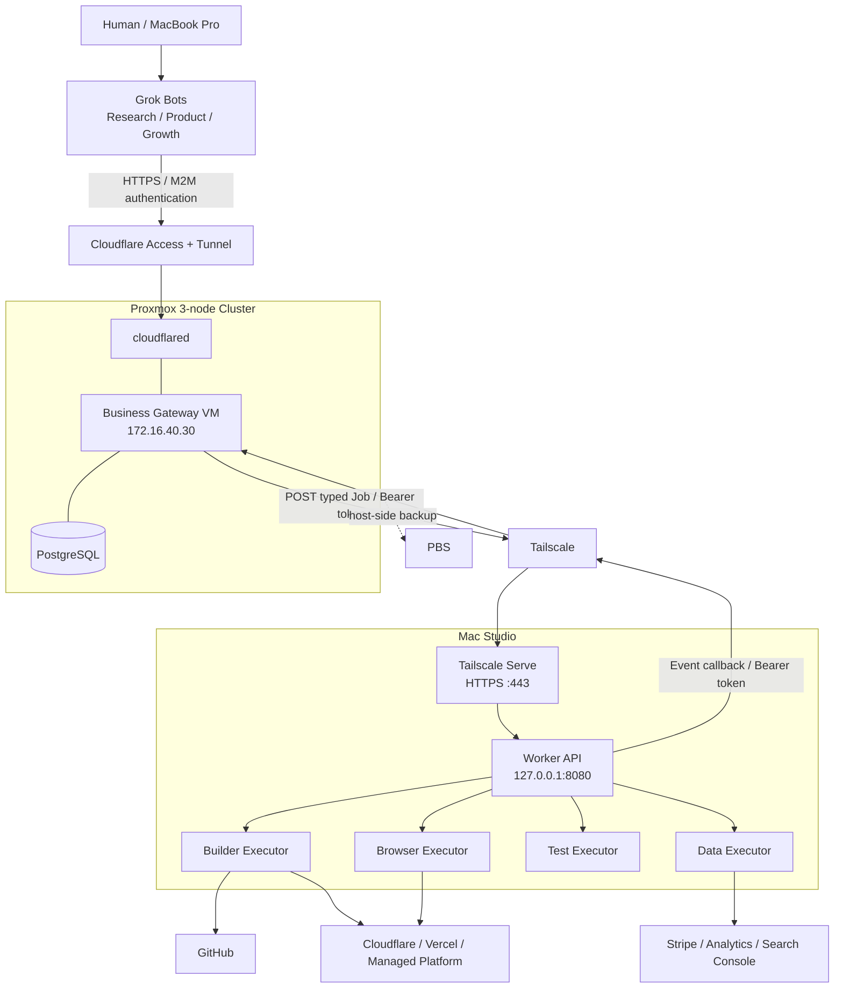
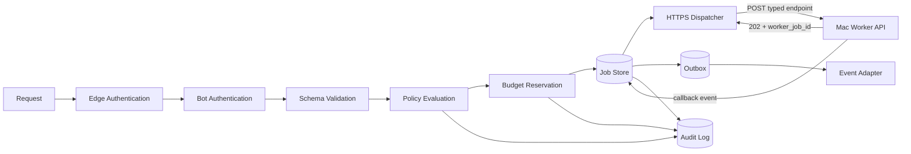
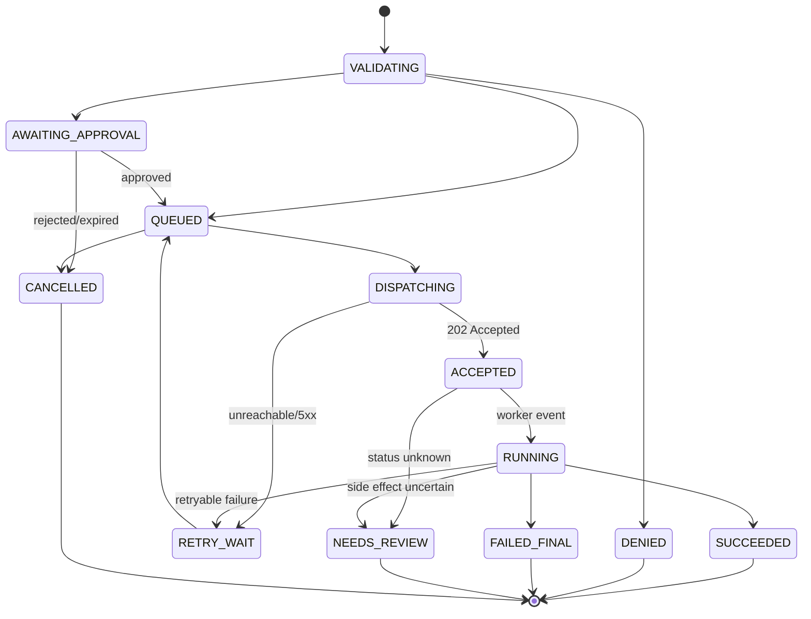

# AI自律事業運営基盤 基本設計書

| 項目 | 内容 |
|---|---|
| 文書名 | AI自律事業運営基盤 基本設計書 |
| バージョン | 0.5 |
| 作成日 | 2026-09-06 |
| 入力文書 | AI自律事業運営基盤 要件定義書 v1.0 |
| 対象フェーズ | Phase 1 MVP |
| ステータス | Gateway and external tunnel deployed / Access configured / Worker implementation in progress |

## 1. 目的

本書は、要件定義書で示された「AI自律事業運営基盤」の Phase 1 を、自宅の Proxmox 3ノードと Mac Studio 上に安全に構築するための基本設計を定義する。

設計の中心は、外部AIとオンプレミスの実行環境の間に Business Gateway を置き、任意コマンド実行ではなく、許可済みの業務 Action だけを、予算・権限・監査の制約下で非同期 Job として実行することである。

## 2. 設計方針

1. 外部AIから Proxmox、Mac Studio、PBS への直接 SSH を許可しない。
2. Business Gateway に汎用 Shell API を実装しない。
3. ネットワーク、アプリケーション、Action Policy の3層で拒否を重ねる。
4. Gateway は Tailscale Serve で公開された型付き Worker API へ Job を dispatch し、SSHや任意コマンド実行を使わない。
5. すべての副作用を Job、Event、Audit Log として追跡可能にする。
6. 予算判定と Job 登録を同一トランザクションで行い、並行実行時の超過を防ぐ。
7. ソースコードと仕様は GitHub、実行状態は PostgreSQL、成果物は GitHub または外部オブジェクトストレージを正とする。
8. Phase 1 では Kubernetes、Redis Cluster、HA PostgreSQL を導入しない。
9. 販売中の Micro SaaS は自宅環境に配置しない。
10. Bot 固有処理は Adapter に閉じ込め、Control Plane を将来交換できるようにする。

## 3. 対象範囲

### 3.1 Phase 1 で構築するもの

- Proxmox 上の Business Gateway VM 1台
- Gateway API、認証、認可、Policy、Job、Event、Audit、Budget 機能
- Mac Studio 上の Worker API とローカルJob Runner
- Builder、Browser、Test、Data の各 Executor
- Cloudflare Tunnel と Cloudflare Access による外部AI向け入口
- Tailscale Serve HTTPS による Gateway と Mac Studio の通信
- GitHub、デプロイ先、Stripe、Analytics との最小連携
- PBS を用いた Gateway VM バックアップ

### 3.2 Phase 1 で構築しないもの

- Kubernetes 上への本基盤の配置
- Gateway のアプリケーションレベル Active-Active 構成
- 高可用 PostgreSQL、Redis、メッセージブローカ専用クラスタ
- Local LLM、RTX Worker、Proxmox Sandbox Worker
- CEO Bot、複雑な Bot 間会話
- 自動返金、銀行操作、無制限の価格変更、自動広告出稿
- Micro SaaS 本番環境の自宅ホスティング

### 3.3 リポジトリ境界

| リポジトリ | 管理対象 |
|---|---|
| `craftzdev/homelab` | Proxmox、Gateway VM、Cloudflare Tunnel、Tailscale Grants、Gatewayの配置と運用 |
| `craftzdev/ai-business-worker` | Mac Studio Worker API、executor、macOS常駐化、Workerのテストとリリース |

WorkerはMac固有の権限、依存関係、リリース周期を持つため、Gatewayおよび
インフラとは別リポジトリで管理する。Phase 1では共有ライブラリを作らず、
Workerリポジトリから生成するOpenAPIをGateway→Worker API契約の正とする。

## 4. 実機確認結果と確定値

### 4.1 確定している前提

| 対象 | 内容 |
|---|---|
| Proxmox ノード1 | `sv-proxmox-01` / `172.16.10.11` |
| Proxmox ノード2 | `sv-proxmox-02` / `172.16.10.12` |
| Proxmox ノード3 | `sv-proxmox-03` / `172.16.10.13` |
| 管理ネットワーク | VLAN 10 / `172.16.10.0/24` |
| Ceph Public | VLAN 20 / `172.16.20.0/24` |
| Ceph Cluster | VLAN 30 / `172.16.30.0/24` |
| VM/Kubernetes | VLAN 40 / `172.16.40.0/24` |
| VLAN 40 Gateway | `172.16.40.1` |
| 主実行ノード | Mac Studio M1 Max / RAM 64 GB |
| バックアップ | PBS を継続利用 |
| リモート接続 | PBS の Tailscale Subnet Router を継続利用 |

### 4.2 2026-09-06 実機確認

| 確認対象 | 実測結果 | 判定 |
|---|---|---|
| Proxmox | 3ノードとも PVE `9.0.11`、online | 正常 |
| Cluster | `homelab`、3 votes、quorum 2、Quorate | 正常 |
| VM/LXC | VM `1200` `ai-gateway-01` を作成済み | 稼働中 |
| `172.16.40.30` | Gateway VMの固定IPとして設定 | 稼働中 |
| `gateway.craftz.dev` | 専用Cloudflare Tunnel経由でloopback APIへ接続 | 稼働中 |
| Ceph OSD | 3 OSDすべて up/in、全129 PGが `active+clean` | データ整合性は正常 |
| Ceph容量 | raw約3.07 TB、利用約30.3 GB、空き約3.04 TB | Gateway配置に十分 |
| `cephrdb_vm` | 3ノードで active、shared、replica size 3 / min_size 2 | Gateway diskに採用 |
| Ceph health | `HEALTH_WARN`。`osd.0` と `osd.2` に BlueStore slow-op indication | PGはclean、警告継続監視 |
| `osd.0` device | SMART PASSED、reallocated/pending/CRC error 0、現在のcommit/apply latency 0 ms | 即時故障の兆候なし |
| Proxmox HA | 3ノードのCRM/LRM/watchdog active、quorum OK | HA利用可能 |
| HA設定 | `vm:1200` と Node Affinity Rule `ai-gateway-placement` を登録済み | `started` / `in use` |
| PBS連携 | ProxmoxにPBS storage登録なし、backup jobなし | 本稼働前の必須作業 |
| Tailscale | MagicDNS `tailb6c7d.ts.net`、Gateway `100.104.73.43` | Serve HTTPS、Gateway tag、Grants稼働中 |
| Gateway復旧試験 | live migration往復、再起動、local backupから隔離restore | 成功 |

### 4.3 確定値

| 項目 | 確定値 |
|---|---|
| Gateway VM ID | `1200` |
| Gateway VM 名 | `ai-gateway-01` |
| Gateway IP | `172.16.40.30/24` |
| Gateway DNS | `172.16.40.1` |
| Gateway primary node | `sv-proxmox-01` |
| Gateway disk storage | `cephrdb_vm` |
| Gateway public hostname | `gateway.craftz.dev` |
| Cloudflare Tunnel | `ai-business-gateway` / `1cb360c1-26be-4f23-b3d3-728689073a04` |
| Gateway external API backend | `http://127.0.0.1:8080`（cloudflared専用） |
| Tailnet account name | `craftzdev.github` |
| Tailnet DNS name | `tailb6c7d.ts.net` |
| Gateway Tailnet node name | `ai-gateway-01` |
| Gateway Tailnet node tag | `tag:ai-gateway` |
| Gateway callback backend | `http://127.0.0.1:8081`（Tailscale Serve専用） |
| Mac Studio Tailnet node name | 現在 `macstudio`、Policy alias `ai-worker-mac-01` |
| Mac Studio Tailnet identity | 現在はuser-owned端末のままhost aliasで限定。専用化時は `tag:ai-worker-trusted` |
| 将来のProxmox Worker tag | `tag:ai-worker-sandbox` |
| Worker API backend | `http://127.0.0.1:8080` |
| Worker API endpoint | `https://macstudio.<tailnet>.ts.net:443` |
| Gateway→Worker transport | Tailscale Serve / HTTPS REST |
| Gateway→Worker authentication | Tailscale Grant + Bearer API Token |
| Worker→Gateway callback | `POST https://ai-gateway-01.<tailnet>.ts.net/v1/worker-events` |
| タイムゾーン | DBはUTC、表示・予算日界はAsia/Tokyo |

`<tailnet>` は実環境では `tailb6c7d` である。`172.16.40.30` は本設計で予約済みとして扱い、DHCP pool から除外する。

## 5. 全体アーキテクチャ



### 5.1 信頼境界

| 境界 | 信頼レベル | 防御 |
|---|---|---|
| Internet / Grok Cloud | 非信頼 | Cloudflare Access、レート制限、Bot署名 |
| Business Gateway | Control Plane | Action Allow List、Policy、Budget、Audit |
| Mac Studio Worker | 制限付き実行環境 | Tailscale Serve、API Token、専用ユーザー、Jobごとの分離、Executor Allow List |
| GitHub / Managed Platform | 外部サービス | 最小権限の短期Credential、対象リポジトリ・プロジェクト制限 |
| Proxmox / PBS / Router | 管理基盤 | AI系ノードからのアクセスをネットワークで拒否 |

## 6. Proxmox / VM 設計

### 6.1 Business Gateway VM

| 項目 | 設計値 |
|---|---|
| VM ID | `1200` |
| VM 名 | `ai-gateway-01` |
| OS | Ubuntu Server 24.04 LTS |
| vCPU | 2 vCPU |
| Memory | 4 GB 固定 |
| Disk | 64 GB、SCSI、discard 有効 |
| Storage | 共有 RBD `cephrdb_vm` |
| NIC | VirtIO 1枚、`vmbr1`、VLAN Tag 40 |
| IP | `172.16.40.30/24` |
| Default Gateway | `172.16.40.1` |
| Guest Agent | 有効 |
| Autostart | 有効 |
| Console | Proxmox 管理者のみ |
| Swap | 原則なし。必要時は小容量 zram を利用 |

### 6.2 配置と可用性

- 通常時は `sv-proxmox-01` を優先する。
- PVE 9では旧HA Groupではなく、Node Affinity Rule `ai-gateway-placement` を使用する。
- Rule は `sv-proxmox-01:3`、`sv-proxmox-02:2`、`sv-proxmox-03:1` の順、strict有効とする。
- VM `1200` は HA Resource として `max_restart=1`、`max_relocate=1`、`failback=0` で登録する。復旧後の不要な自動戻しを避ける。
- ホスト障害時は同一 VM を別ノードで再起動する。Phase 1 は単一 Gateway/DB のため、再起動中は Job の新規受付が停止する。
- Gateway復旧後、Worker APIから実行状態を再取得する。副作用のある Job は自動再実行せず、冪等性が確認できる Job だけを再dispatchする。
- CephはGateway用storageとして採用する。HA Resourceはclean PG、正常なquorum、live migration成功を確認して有効化したが、`osd.0` と `osd.2` の slow-op warning は継続監視し、増加時はデバイスとI/O経路を調査する。
- local backupからの隔離restore testは完了した。PBS storage登録、PBS backup job作成、PBSからのrestore test完了は引き続き本稼働条件とする。

HA登録済みの確定パラメータは次のとおりである。

```bash
ha-manager add vm:1200 --state started --max_restart 1 --max_relocate 1 --failback 0
ha-manager rules add node-affinity ai-gateway-placement \
  --resources vm:1200 \
  --nodes sv-proxmox-01:3,sv-proxmox-02:2,sv-proxmox-03:1 \
  --strict 1
```

### 6.3 VM 内サービス配置

Phase 1 は Docker Compose を用いる。コンテナの種類は以下とする。

```text
ai-gateway-01
├── reverse-proxy       TLS終端、request size、rate limit
├── gateway-api         Authentication / Authorization / REST API
├── gateway-scheduler   Job dispatch、Retry、Budget締め、Event配送
├── postgresql          System of Record
├── cloudflared         CloudflareへのOutbound Tunnel
└── metrics-agent       Host/Containerメトリクス
```

専用メッセージブローカは置かず、PostgreSQL の Job Table と Transactional Outbox を利用する。これにより Phase 1 の部品数を減らしつつ、Job 登録と Event 永続化の一貫性を確保する。

## 7. ネットワーク設計

### 7.1 通信経路

| Source | Destination | Port/Protocol | 用途 | 方針 |
|---|---|---:|---|---|
| Grok Cloud | Cloudflare Edge | TCP/443 | Job API | 許可 |
| cloudflared | Cloudflare Edge | TCP/443 または QUIC/7844 | Tunnel | Outbound のみ許可 |
| Gateway | Mac Studio Tailscale Serve | TCP/443 | typed Job dispatch、状態照会 | Tailnet内だけ許可 |
| Mac Studio | Gateway Tailscale Serve | TCP/443 | Job event callback | Tailnet内だけ許可 |
| MacBook Pro | Gateway 管理API | TCP/443 | 承認、状態確認 | Cloudflare Accessの人間認証経由のみ許可 |
| Gateway | GitHub / Event先 | TCP/443 | Event、Issue、Credential交換 | 宛先 Allow List |
| Mac Studio | GitHub / package registry | TCP/443 | clone、build、push | 宛先 Allow List |
| Mac Studio | Preview/Production | TCP/443 | deploy、E2E | Jobで許可された対象のみ |
| Proxmox host | PBS | 既存バックアップ通信 | VM Backup | 既存設定を使用 |

### 7.2 明示的に拒否する通信

Gateway と Mac Studio の AI 用アカウントから、次の管理面への新規接続を拒否する。

- `172.16.10.0/24` の Proxmox 管理GUI、SSH
- `172.16.20.0/24` の Ceph Public（Gatewayには不要）
- `172.16.30.0/24` の Ceph Cluster
- PBS 管理画面および SSH
- IX2215、Aruba、NAS の管理IP
- 許可されていない内部 RFC1918 宛先

拒否は、IX2215/ネットワークACL、Proxmox Firewall、Gateway の host firewall の順に多層化する。Gateway VM に VLAN 10/20/30 の NIC は追加しない。Proxmox API Credential も Gateway に付与しない。

### 7.3 Tailscale 方針

- 既存の PBS Subnet Router は既存管理用途として維持するが、GatewayとMac Studio間の経路には使用しない。
- Gateway VM と Mac Studio 自身に Tailscale client を入れ、端末Identityで相互を識別する。
- Tailscale Funnelは両ノードとも無効とし、Serveの公開範囲をTailnet内に限定する。
- Mac StudioのWorker APIは `127.0.0.1:8080` だけでlistenし、Tailscale ServeがTailnet内のHTTPS `:443` としてproxyする。
- Gatewayのcallback受信APIは外部APIと分離して `127.0.0.1:8081` だけでlistenし、Gateway上のTailscale ServeでTailnet内に公開する。このlistenerは `/v1/worker-events` 以外を提供しない。
- `tag:ai-gateway` から現Mac Studioのhost aliasおよびWorker tagのTCP/443をJob dispatch用に許可する。
- 現Mac Studioのhost aliasおよびWorker tagから `tag:ai-gateway` のTCP/443をcallback用に許可する。
- 将来のProxmox Worker VMには `tag:ai-worker-sandbox` を付与し、Proxmox host自体をAI実行経路へ参加させない。
- 新規ポリシーは deny-by-default とし、Tailscale の現行推奨である Grants を優先する。
- SSH、Screen Sharing、SMB、Worker API以外のポートは両方向とも許可しない。
- タグ付き端末ではTailscale ServeのユーザーIdentity Headerに依存できないため、API Token認証を必須とする。

適用済みポリシーは `ai-business-platform/infra/tailscale/policy.hujson` を正とする。Mac Studioは管理用ワークステーションも兼ねるため、端末tagを付けるとuser identityを失う点を避け、現時点では固定Tailscale IPのhost aliasを使用する。Gatewayはtagged deviceとし、従来の全端末向けallow-all ACLは削除済みである。

```json
{
  "hosts": {
    "ai-worker-mac-01": "100.105.200.6"
  },
  "tagOwners": {
    "tag:ai-gateway": ["autogroup:admin"],
    "tag:ai-worker-trusted": ["autogroup:admin"],
    "tag:ai-worker-sandbox": ["autogroup:admin"]
  },
  "grants": [
    {
      "src": ["tag:ai-gateway"],
      "dst": ["ai-worker-mac-01", "tag:ai-worker-trusted", "tag:ai-worker-sandbox"],
      "ip": ["tcp:443"]
    },
    {
      "src": ["ai-worker-mac-01", "tag:ai-worker-trusted", "tag:ai-worker-sandbox"],
      "dst": ["tag:ai-gateway"],
      "ip": ["tcp:443"]
    }
  ]
}
```

### 7.4 外部公開方針

- Router のポートフォワードおよび Gateway のグローバルIP直接公開は禁止する。
- 専用Tunnel `ai-business-gateway` が外向きに接続し、`gateway.craftz.dev` を同一VMの loopback listenerへproxyする。Tunnel、DNS、HTTPS疎通は構築済みである。
- Bot 用 Access Application は `Service Auth` とし、Bot ごとに別 Service Token を発行する。
- 人間用管理入口は別 Access Application または別 hostname に分離し、IdP + MFA を必須にする。
- Mac Studio Worker APIはTailscale Serve以外では公開しない。LAN IPの直接利用はfallbackにも採用しない。
- 外部 listener は Cloudflare が付与する Access JWT の署名、issuer、audience、有効期限を Gateway でも検証する。

## 8. Business Gateway 論理構成



### 8.1 Gateway API

Gateway API は次を担当する。

- Request の認証、署名、時刻、重複検査
- Action ごとの JSON Schema 検証
- Bot、Project、Action、Environment 単位の認可
- Policy と Budget の評価
- Job と Audit Log の同時登録
- Job Status、Event、集計済み Business State の参照
- 人間承認の受付

### 8.2 Policy Engine

Policy は Git 管理された宣言的設定を読み込み、起動時と明示的 reload 時に検証する。Policy 変更自体を高リスク操作とし、Bot から変更できないようにする。

判定入力は少なくとも以下を含む。

- `bot_id`、`project_id`、`action`
- `environment`（research / preview / production）
- 対象 domain、repository、deployment project
- 見積コスト、当日・当月消費額
- 同時実行数、直近の実行回数
- 人間承認の有無と有効期限
- 営業禁止カテゴリ、個人情報取扱いの有無

判定結果は `ALLOW`、`DENY`、`REQUIRE_APPROVAL` の3種類とする。

### 8.3 Job Manager / Scheduler

- PostgreSQL を Queue として使用する。
- Scheduler は登録済み Worker capability と Action を照合し、Tailscale Serve経由で型付きendpointへdispatchする。
- Workerは受付時にJobをローカルSQLiteへ永続化し、`202 Accepted` と `worker_job_id` を返す。
- Gatewayは `dispatch_id` を冪等キーとして使用する。応答消失時も同じIDで再送し、Workerは同じJobを二重実行しない。
- Workerは状態変化をGatewayへcallbackする。callback消失時はGatewayがWorker APIをpollして補完する。
- Retry は Action ごとの上限、backoff、冪等性属性に従う。
- Scheduler が停止しても Job は DB に残り、復旧後に継続する。

### 8.4 Event Adapter

Event 配送方式の差を吸収する Adapter を提供する。

1. Bot Webhook（利用可能性確認後に有効化）
2. GitHub Event / Issue / Check Run
3. Bot からの定期 Polling

Transactional Outbox により、Job 完了のDB更新と Event 登録を同一トランザクションで行う。配送は at-least-once とし、受信側は `event_id` で重複排除する。

### 8.5 Audit Log

以下を改変せず記録する。

- 認証成否、Request ID、Bot ID
- 入力 Parameter の hash と機密値を除いた要約
- Policy version、判定、deny reason
- Budget の見積、予約、実績、解放
- Job 状態遷移、Worker ID、所要時間
- 外部副作用の対象と結果
- 人間承認者、理由、時刻、有効期限

監査テーブルはアプリケーションRoleから UPDATE/DELETE 不可とし、追記専用 DB Role で書き込む。日次で監査レコードの hash chain の終端値を外部保管し、削除・改変を検知可能にする。

## 9. 認証・認可設計

### 9.1 外部 Bot の認証

外部からの要求は二段階で認証する。

1. Cloudflare Access Service Token による Edge 認証と Gateway での Access JWT 検証
2. Gateway の Bot Credential による Application 認証

Application 認証では次のヘッダを使用する。

| Header | 内容 |
|---|---|
| `X-Bot-Id` | Bot の一意ID |
| `X-Request-Id` | UUID v7。Bot単位で一意 |
| `X-Timestamp` | UTC ISO 8601 |
| `X-Signature` | canonical request の HMAC-SHA256 |
| `Idempotency-Key` | 副作用の重複防止キー |

canonical request は HTTP method、path、body SHA-256、timestamp、request ID を連結して生成する。許容時刻差は初期値5分とし、`bot_id + request_id` に一意制約を設けて replay を拒否する。Gateway と Bot の時刻同期を前提とする。

### 9.2 Worker の認証

- Gateway→Workerは `tag:ai-gateway` から `tag:ai-worker-trusted` へのTCP/443 Grantと、Worker専用Bearer API Tokenを重ねる。
- Worker→Gateway callbackは `tag:ai-worker-trusted` から `tag:ai-gateway` へのTCP/443 Grantと、callback専用Bearer API Tokenを重ねる。
- dispatch用とcallback用のTokenは分離し、256-bit以上の乱数、constant-time比較、個別失効、ローテーションを必須とする。
- Tailscaleのタグはネットワーク層の制約であり、API Token認証の代用にはしない。
- Tailscale application capabilitiesはPhase 1では使用せず、将来の細粒度認可候補とする。

### 9.3 人間の認証

- 管理APIは Cloudflare Access または Tailscale 経由に限定する。
- Cloudflare Access を使う場合は IdP + MFA とし、M2M token を人間承認に利用しない。
- 承認操作には、対象 Action、対象環境、上限金額、有効期限、承認理由を必須にする。
- Phase 1 の承認操作は `gatewayctl` または最小管理画面で提供する。

## 10. Action とリスク分類

### 10.1 リスクレベル

| Level | 意味 | 例 | 既定動作 |
|---|---|---|---|
| R0 | 読み取り、集計 | analytics.read、browser.research | Allow List 内で自動 |
| R1 | 隔離Workspace内の変更 | code.build、test.run | 上限内で自動 |
| R2 | 外部への可逆な変更 | PR作成、Preview deploy、下書き投稿 | 条件付き自動 |
| R3 | 本番または費用を伴う変更 | Production deploy、公開投稿、DNS小変更 | 初期は人間承認 |
| R4 | 禁止操作 | 返金、送金、Policy変更、DB破壊 | 常に拒否 |

### 10.2 Bot 権限

| Action | Research | Product | Growth | Risk | Phase 1 条件 |
|---|---:|---:|---:|---:|---|
| `browser.research` | ○ | ○ | ○ | R0 | domain deny list、page/runtime上限 |
| `analytics.read` | ○ | ○ | ○ | R0 | 集計済みデータのみ返す |
| `stripe.read` | × | ○ | ○ | R0 | restricted read-only key |
| `code.build` | × | ○ | × | R1 | 指定 repo、隔離 workspace |
| `code.fix` | × | ○ | × | R1 | 差分・ファイル数・runtime上限 |
| `test.run` | × | ○ | ○ | R1 | 許可済み test profile |
| `git.pull_request.create` | × | ○ | × | R2 | branch protection を維持 |
| `deploy.preview` | × | ○ | × | R2 | 許可済み project のみ |
| `deploy.production` | × | 条件付 | × | R3 | 当面は人間承認必須 |
| `content.draft` | × | ○ | ○ | R1 | 下書き保存まで |
| `content.publish` | × | × | 条件付 | R3 | domain/channel別承認 |
| `refund` | × | × | × | R4 | API自体を提供しない |
| `fund.transfer` | × | × | × | R4 | API自体を提供しない |
| `gateway.policy.update` | × | × | × | R4 | 人間のGitOpsのみ |

Action 名、入力 Schema、許可 Executor、timeout、retry 可否、max cost、risk level は Action Registry で一元管理する。Worker は Registry にない Action を実行しない。

## 11. Job 設計

### 11.1 状態遷移



### 11.2 Dispatch、Callback、Retry

| 項目 | 初期値 |
|---|---:|
| Dispatch connect timeout | 5秒 |
| Dispatch response timeout | 15秒 |
| Worker status poll | callbackがない場合30秒 |
| Worker progress event | 状態変化時、および実行中60秒ごと |
| Job default timeout | 30分 |
| Build max timeout | 120分 |
| Browser max timeout | 30分 |
| Default retry | 最大2回、指数 backoff |

- Workerが停止・到達不能の場合、GatewayはJobを `RETRY_WAIT` に置き、上限内で再dispatchする。
- WorkerがJobを受理した後にHTTP応答が失われても、同じ `dispatch_id` の再送に対して同じ `worker_job_id` を返す。
- callbackが届かない場合、Gatewayは `GET /v1/jobs/{worker_job_id}` で状態を照会する。
- 読み取り、build、test など再実行可能な Action は再キューできる。
- deploy、publish、外部書込みなどは、外部側の idempotency key または状態照会で結果を確定できない限り `NEEDS_REVIEW` とする。

### 11.3 Job 入力例

```json
{
  "action": "code.build",
  "project_id": "p001",
  "spec_id": "spec-001",
  "environment": "preview",
  "parameters": {
    "repository": "github-org/example-saas",
    "base_ref": "main",
    "acceptance_test_profile": "web-mvp-v1"
  },
  "limits": {
    "max_runtime_seconds": 7200,
    "max_cost_jpy": 3000
  }
}
```

`parameters` に任意 Shell command は受け付けない。実際の command、container image、作業ディレクトリ、許可環境変数は Action Registry と Executor 側の実装で決める。

## 12. API 設計

### 12.1 Bot / Operator API

| Method | Path | 用途 |
|---|---|---|
| POST | `/v1/jobs` | Job 登録 |
| GET | `/v1/jobs/{job_id}` | Job 状態、結果要約取得 |
| POST | `/v1/jobs/{job_id}/cancel` | 未開始 Job のキャンセル |
| GET | `/v1/events` | Bot向け Event polling |
| GET | `/v1/projects/{project_id}/state` | 集計済み Business State |
| GET | `/v1/budgets/usage` | 利用額と残予算 |
| GET | `/v1/approvals` | 承認待ち一覧（人間のみ） |
| POST | `/v1/approvals/{approval_id}/approve` | 期限・上限付き承認（人間のみ） |
| POST | `/v1/approvals/{approval_id}/reject` | 拒否（人間のみ） |

### 12.2 Mac Studio Worker API

| Method | Path | 用途 |
|---|---|---|
| POST | `/v1/jobs/build` | Builder Job受付 |
| POST | `/v1/jobs/browser` | Browser Job受付 |
| POST | `/v1/jobs/test` | Test Job受付 |
| POST | `/v1/jobs/data` | Data集計Job受付 |
| GET | `/v1/jobs/{worker_job_id}` | Worker側のJob状態・結果要約 |
| POST | `/v1/jobs/{worker_job_id}/cancel` | 未開始または安全に停止可能なJobの取消し |
| GET | `/health` | Worker APIとlocal queueのhealth |

Worker APIは `127.0.0.1:8080` でlistenし、Tailscale Serveだけが `https://macstudio.<tailnet>.ts.net:443` としてproxyする。Job受付は `202 Accepted` と次の最小応答を返す。

```json
{
  "worker_job_id": "wjob_01...",
  "dispatch_id": "dsp_01...",
  "status": "ACCEPTED",
  "status_url": "/v1/jobs/wjob_01..."
}
```

### 12.3 Worker Callback API

GatewayはTailnet内に次のendpointだけをWorker向けに提供する。

| Method | Path | 用途 |
|---|---|---|
| POST | `/v1/worker-events` | accepted、started、progress、completed、failed Event |

callbackには `event_id`、`dispatch_id`、`worker_job_id`、`sequence` を必須とする。Gatewayは `event_id` で重複排除し、同一Jobでは `sequence` の後退を拒否する。

### 12.4 API 共通仕様

- JSON のみ。API version は path と payload の `schema_version` で管理する。
- Request body 上限は1 MiBを初期値とし、大きな成果物は保存先 URL と hash だけを渡す。
- エラーは `code`、`message`、`request_id`、`retryable` を返す。
- Job 作成は `Idempotency-Key` 単位で同じ応答を返す。
- Gateway→Workerは `dispatch_id`、Worker→Gatewayは `event_id` で冪等にする。
- 一覧APIは cursor pagination とし、無制限取得を許可しない。
- Log、secret、個人情報を API 応答に含めない。

## 13. データ設計

### 13.1 主要テーブル

| テーブル | 主な役割 |
|---|---|
| `bots` | Bot ID、status、credential version |
| `projects` | 事業単位、repository、外部project参照 |
| `action_registry` | Action schema、risk、executor、timeout、retry |
| `jobs` | 要求、状態、dispatch、Worker Job参照、結果要約 |
| `job_attempts` | 試行単位の Worker、開始終了、error |
| `workers` | Worker ID、status、capability、API token version |
| `policies` | version、hash、適用時刻 |
| `policy_decisions` | 判定入力要約、結果、reason |
| `approvals` | 承認対象、承認者、上限、有効期限 |
| `budget_limits` | 期間・scope別の上限 |
| `budget_ledger` | reserve、settle、release の台帳 |
| `events` | 標準Event envelope |
| `outbox` | Event配送状態、再送回数 |
| `audit_logs` | 追記専用監査記録 |
| `business_snapshots` | Bot に返す集計済み KPI |

### 13.2 保存期間

| データ | 保存期間 |
|---|---|
| Job と Policy Decision | 1年 |
| Audit Log | 3年を初期値。法務要件により延長 |
| Worker 詳細Log | 30日 |
| Event 配送履歴 | 90日 |
| Business Snapshot | 2年 |
| Secret | DBに平文保存しない |

## 14. Budget Controller 設計

### 14.1 階層

上位から下位へすべての上限を同時に評価する。

```text
Global monthly
├── Bot daily
├── Action daily
└── Project total / daily
    ├── Runtime minutes
    ├── API usage
    ├── Deploy count
    └── External spend
```

### 14.2 予約と精算

1. Job 登録時に `estimated_cost_jpy` を算出する。
2. 関係する Budget 行を transaction 内で lock する。
3. `spent + reserved + estimate <= limit` を満たす場合だけ予約して Job を作成する。
4. 完了時に実績額を settle し、差額を release する。
5. 結果不明の外部課金は最大見積額を保持し、reconciliation 後に精算する。

金額は浮動小数点を使わず、日本円の整数で保持する。USD 等は原通貨額と換算レート、換算時刻を併記する。費用見積が必須の Action で見積不能な場合は既定で拒否する。

### 14.3 初期 Policy 例

```yaml
global:
  monthly_budget_jpy: 30000
research:
  daily_budget_jpy: 500
product:
  project_budget_jpy: 3000
growth:
  daily_budget_jpy: 1000
limits:
  new_projects_per_week: 2
  production_deploys_per_day: 5
  browser_runtime_minutes_per_day: 120
```

値は要件定義書の例であり、本稼働前に人間が確定する。

## 15. Mac Studio Worker 設計

### 15.1 実行モデル

- macOS に `business-worker` 専用ユーザーを作成する。
- Worker API は `launchd` で常時起動し、`127.0.0.1:8080` だけでlistenする。
- 現在のTailscale node名は `macstudio`、Policy上のhost aliasは `ai-worker-mac-01` とし、Tailscale ServeがWorker APIをTailnet内のHTTPS `:443` に公開する。専用端末へ分離する段階で `tag:ai-worker-trusted` を付与する。
- Tailscale Funnelは有効化しない。
- WorkerはJob状態をローカルSQLiteへ永続化し、再起動後も受付済みJobとdispatch重複判定を復元する。
- Job は `/Users/business-worker/workspaces/<job_id>/` に分離する。
- 個人用ホーム、写真、Keychain、ブラウザプロファイルへのアクセスを与えない。
- Job ごとに checkout または worktree を作り、終了後に保持Policyに従って削除する。
- Builder Phase 1はCodex CLIの `workspace-write` sandboxと専用OSユーザーを併用する。
  信頼できないrepositoryやtest commandを許可する前に、コンテナ境界を追加する。
- macOS ホスト上で root command を実行する Action は提供しない。

### 15.2 Executor

| Executor | Capability | 主なツール | 出力 |
|---|---|---|---|
| Builder | `code.build`, `code.fix` | Codex CLI、Git、Python | 一時branch、patch、build summary、test log |
| Browser | `browser.research`, `browser.verify` | Playwright | 構造化JSON、screenshot、E2E result |
| Test | `test.run` | project固有 test runner | test report、coverage、artifact hash |
| Data | `analytics.aggregate` | Python/Node、各種read-only API | KPI snapshot |

### 15.3 Sandbox と制限

- 将来コンテナ化するActionでは許可imageを固定し、`latest` tag は使わない。
- container は原則 read-only root filesystem、capability drop、host network 無効とする。
- repository workspace と専用temporary directoryだけをmountする。
- CPU、memory、disk、process、runtime に上限を設ける。
- Playwright は事業専用 browser profile を使用し、個人ブラウザの cookie を流用しない。
- 外部URLは Action の target allow/deny list で検査し、localhost、metadata endpoint、内部管理CIDRへの SSRF を拒否する。
- Job Log は secret redaction を通してから送信する。

### 15.4 Credential 受け渡し

- 長期 secret を Job payload に入れない。
- GitHub は project を限定した GitHub App installation token を優先する。
- deploy、Analytics、Stripe は scope を絞った専用Credentialを利用する。
- Gateway が短期Credentialまたは一回限りの参照tokenを発行し、Worker は memory または一時 Keychain に保持する。
- Worker APIのdispatch tokenとGateway callback tokenは、専用ユーザーだけが読める
  mode `0600` のruntime設定へ別項目として保存する。対話ユーザーで動かすCredentialは
  macOS Keychainを利用する。
- Codex CLIは専用の `CODEX_HOME=/Users/business-worker/.codex` を使う。Phase 1では
  現在のChatGPT認証をmode `0600` で複製し、個人ホームを直接参照しない。本稼働では
  Worker専用API project keyまたはworkload identityへの移行を検討する。
- Job 終了時に一時Credentialと作業環境を破棄する。

## 16. 外部サービス連携

### 16.1 GitHub

- 仕様、ソース、PR、Issue、Workflow を Source of Truth とする。
- `main` の branch protection、required checks、review policy は Bot が解除できないようにする。
- Bot の変更は専用 branch と PR を原則とする。
- Worker Credential は許可 repository の Contents/PR/Checks に限定する。
- Secret、生のAudit Log、顧客データを commit しない。

### 16.2 Deploy Platform

- Preview は Action Allow List と project mapping が一致すれば自動化可能とする。
- Production は Phase 1 では人間承認を必須とする。
- deploy request に immutable commit SHA を必須とし、曖昧な branch head を本番へ出さない。
- deploy 後に URL、deployment ID、commit SHA、health check を記録する。

### 16.3 Stripe / Analytics

- Stripe は restricted read-only key を利用し、返金、送金、価格変更権限を付与しない。
- Data Worker が必要な期間と指標だけを集計し、Bot へ raw event や個人情報を渡さない。
- Business Snapshot は訪問数、signup率、paid conversion、MRR、費用、refund率などの集計値で構成する。

## 17. Event 設計

Event envelope は Adapter に依存しない形式とする。

```json
{
  "event_id": "evt_01...",
  "event_type": "build.completed",
  "occurred_at": "2026-09-05T01:17:00Z",
  "project_id": "p001",
  "job_id": "job_01...",
  "producer": "worker.mac-studio-01",
  "schema_version": "1.0",
  "data": {
    "commit_sha": "<sha>",
    "tests_passed": 42,
    "tests_failed": 0
  }
}
```

初期 Event 種別は次とする。

- `job.queued`、`job.started`、`job.failed`、`job.completed`
- `build.completed`、`test.completed`
- `deployment.preview.completed`、`deployment.production.completed`
- `policy.denied`、`budget.threshold_reached`
- `approval.requested`、`approval.resolved`
- `worker.offline`

## 18. Secret 管理

- Secret は Git に平文保存しない。
- Git 管理が必要な設定は SOPS + age で暗号化し、復号鍵は VM 外にもオフラインバックアップする。
- Gateway runtime secret は root のみ読める場所または systemd credential として渡す。
- Mac Studio の長期 secret は専用 Keychain または専用ユーザーのみ読めるファイルに置く。
- Bot、Worker、Cloudflare、GitHub、Stripe のCredentialは個別に発行し、一括共用しない。
- ローテーション周期、所有者、最終更新日、有効期限を secret inventory で管理する。
- Credential 漏洩時は対象 Bot/Worker 単位で即時失効できることを受入条件とする。

## 19. 監視・ログ・通知

### 19.1 主要メトリクス

- Gateway API availability、latency、4xx/5xx
- Job queue depth、oldest queued age、状態別件数
- Job success rate、retry、timeout、所要時間
- Worker health、callback freshness、capability、同時実行数
- Event outbox backlog、delivery failure
- Budget spent/reserved、80%/100% threshold
- DB connection、disk usage、backup freshness
- certificate と token の有効期限

### 19.2 通知条件

| Severity | 条件 | 通知 |
|---|---|---|
| Critical | Gateway停止、Audit書込み不能、DB異常、予算超過 | 即時、人間へ通知 |
| High | Worker長時間offline、Production結果不明、Event滞留 | 即時、人間へ通知 |
| Warning | Disk 80%、Budget 80%、証明書期限30日以内 | 営業時間内通知 |
| Info | Job成功、Preview完成 | Bot Event。人間通知は既定で抑制 |

### 19.3 Log 方針

- Gateway は構造化 JSON Log、Mac Studio は構造化 Job Log を出力する。
- `request_id`、`job_id`、`project_id`、`worker_id` で相関できるようにする。
- Authorization header、cookie、API key、顧客情報、source code 全文は出力しない。
- 初期は journald と DB Audit を利用し、必要に応じ既存 Prometheus/Grafana へ接続する。

## 20. バックアップと復旧

### 20.1 バックアップ

| 対象 | 方式 | 頻度 | 初期保持 |
|---|---|---|---|
| Gateway VM | Proxmox から PBS へ snapshot backup | 毎日 | daily 7、weekly 4、monthly 6 |
| PostgreSQL | encrypted logical backup | 毎日 | 30日 |
| Policy / Compose / migration | GitHub | 変更ごと | Git履歴 |
| age key / recovery secret | 暗号化したオフライン保管 | 変更時 | 旧鍵も失効確認まで保持 |

2026-09-06時点では、Proxmox clusterにPBS storageもbackup jobも登録されていない。Gateway本稼働前に登録・作成する。PBS backup は Proxmox host 側から実行し、Gateway VM や AI Worker に PBS Credential を渡さない。

### 20.2 目標値

| 項目 | Phase 1 目標 |
|---|---|
| RPO | 24時間以内 |
| RTO | 60分以内 |
| ホスト障害時 | Proxmox HA 利用時は別ノードで自動再起動 |
| Mac Studio停止時 | 新規実行は待機。Gateway、Job、Audit は継続 |
| Gateway停止時 | 本番 Micro SaaS は無影響。自動運営のみ停止 |

四半期に1回、隔離ネットワークで Gateway VM と PostgreSQL の復元試験を行い、RPO/RTOを実測する。

## 21. 障害時の挙動

| 障害 | システム挙動 | 復旧方針 |
|---|---|---|
| Mac Studio停止 | dispatchは失敗しJobはRETRY_WAIT。実行中Jobは状態不明になり得る | 復帰後にWorker状態を照会し、安全なJobだけ再dispatch |
| Gateway VM停止 | 新規受付とEvent配送停止。本番SaaSは継続 | Proxmox HA再起動またはPBS復元 |
| Cloudflare障害 | 外部Botから受付不能。LAN/Tailscale管理は維持 | Job状態を保持し、復旧後再開 |
| PostgreSQL異常 | fail closed。Job受付・Policy判定を停止 | DB復旧。Audit欠落の有無を検証 |
| Worker結果送信失敗 | Workerが同じ event_id でcallbackを再送。Gatewayも状態をpoll | Gatewayが重複排除 |
| Deploy応答不明 | 自動retryせず NEEDS_REVIEW | deployment ID / commit SHAで外部照会 |
| 予算計測不能 | 課金Actionを拒否または予約維持 | reconciliation 後に人間が解消 |
| 時刻ずれ | Bot Requestを拒否、Alert | NTP復旧後に再送 |

## 22. 構築順序

### Step 0: 事前確認

- 実機確認済みのProxmox cluster quorum、Ceph、HAの結果を記録する。
- `osd.0` と `osd.2` のBlueStore slow-op warningを再確認し、継続・増加時はI/O原因を解消する。
- PBS storageをProxmoxへ登録し、VM 1200向けbackup jobとrestore testを準備する。
- Mac StudioとGatewayのTailnet参加、Gateway tag、Grants、MagicDNS domainは確定済み。
- Cloudflare Zone、Tunnel、公開hostnameは確定・構築済み。
- Grok Bot の外部HTTP、Webhook、定期 polling 能力を確認する。

### Step 1: Gateway 基盤

- Ubuntu 24.04 Cloud-Init template から VM を作成する。
- VLAN 40、host firewall、NTP、automatic security update を設定する。
- PostgreSQL と Gateway の skeleton を起動する。
- PBS backup と restore 手順を確認する。

### Step 2: セキュリティ境界

- Cloudflare Tunnel、Access Service Auth、Gateway側JWT検証は構築済み。人間用Accessは管理UI導入時に追加する。
- Bot HMAC、Worker/Callback API Token、replay 防止を実装する。
- Tailscale Grants、GatewayとMac Studio双方のTailscale Serveは構築済み。
- GatewayからVLAN 10/20/30への拒否は確認済み。Worker構築後にPBS、Router、NASを含む拒否を再試験する。

### Step 3: Job 基盤

- Action Registry、Policy Engine、Budget Ledger を実装する。
- Job dispatch、callback、poll fallback、timeout、retry、outbox、audit を実装する。
- 読み取り Action で状態遷移と障害復旧を検証する。

### Step 4: Mac Studio Worker

- 専用ユーザー、launchd、Worker API、SQLite queue、Tailscale Serveは構築済み。workspaceとcontainer sandboxを追加する。
- Builder、Test、Browser、Data の順で Executor を追加する。
- GitHub の専用Credentialと branch protection を設定する。

### Step 5: End-to-End

- Research から Product、build、test、preview、review、production承認、Growth計測までを1事業で通す。
- 実際の予算予約・精算、Event再送、Audit追跡、障害復旧を確認する。

## 23. 受入試験

### 23.1 機能

- 正規 Bot が許可 Action を登録し、GatewayがWorkerへdispatchして完了できる。
- Bot 権限外 Action は `DENY` となり、理由が Audit に残る。
- 同じ `Idempotency-Key` の再送で Job が重複しない。
- Worker停止時はretry待ちとなり、復帰後に安全なJobだけが再dispatchされる。
- Production deploy は有効な人間承認なしでは実行されない。
- Event配送に失敗しても Outbox から再送される。

### 23.2 セキュリティ

- 期限切れ、署名不正、時刻差超過、再送 Request を拒否する。
- Gateway以外のTailnet nodeからMac Studio Worker APIへ接続できない。
- Mac Studio以外のTailnet nodeからGateway callback APIへ接続できない。
- 正しいTailnet tagを持っていてもAPI TokenがなければWorker APIを利用できない。
- Worker から Proxmox、PBS、Router、NAS 管理面へ接続できない。
- Job payload に Shell command を入れても Schema Validation で拒否する。
- Browser Executor から localhost、metadata endpoint、管理CIDRへアクセスできない。
- Bot/Worker Credential を1件失効し、他の Bot/Worker に影響せず遮断できる。
- Log と API 応答に secret が含まれない。

### 23.3 Budget / Audit

- 同時に複数 Job を登録しても予約額が上限を超えない。
- 上限到達後の Action は Gateway が強制拒否する。
- 予約、精算、差額解放を台帳で追跡できる。
- Request から Policy、Job、Worker attempt、外部結果まで1つの correlation で追跡できる。

### 23.4 可用性 / 復旧

- Mac Studio停止中も Gateway、Job、Audit が保持される。
- Proxmox 1ノード停止時に、HA 設定済みなら Gateway VM が別ノードで起動する。
- PBS から別 VM ID へ復元し、DBとAuditを検証できる。
- Gateway停止中も外部に配置した Micro SaaS が継続稼働する。

## 24. 要件トレーサビリティ

| 要件領域 | 対応設計 |
|---|---|
| Think / Control / Execute 分離 | 5、8、15章 |
| Gateway経由、汎用Shell禁止 | 2、9、11、12章 |
| Bot別Authorization | 10章 |
| 非同期Job | 11、12、13章 |
| Event連携とFallback | 8.4、17章 |
| Budget Control | 14章 |
| Audit Log | 8.5、13、19章 |
| Mac Studio Worker | 15章 |
| Proxmox Gateway / 将来Sandbox | 6章。SandboxはPhase 2 |
| PBSの役割維持 | 7、20章 |
| Tailscale / Cloudflare | 7章 |
| GitHub Source of Truth | 16.1章 |
| 本番を自宅に置かない | 3.2、16.2章 |
| Human Approval | 9.3、10、12章 |
| 可用性、監査性、拡張性、可搬性 | 5、8、19、20、21章 |
| Phase 1 成功条件 | 22、23章 |

## 25. 主要な設計判断

| ID | 判断 | 理由 |
|---|---|---|
| ADR-001 | Phase 1 は単一 Gateway VM | 要件を満たしつつ運用部品を最小化するため |
| ADR-002 | Gateway VM は VLAN 40 のみ | Proxmox/Ceph管理面から分離するため |
| ADR-003 | GatewayからTailscale Serve経由で型付きWorker APIを呼ぶ | Tailnet限定HTTPSとAction APIにより、SSHなしで実行範囲を制限するため |
| ADR-004 | Queue は PostgreSQL | Job、Budget、Audit、Outbox のトランザクション整合性を保ち、Redisを不要にするため |
| ADR-005 | Cloudflare Access + Bot署名 | Edge と Application の二層で M2M を認証するため |
| ADR-006 | Worker認証はGrants + API Token | Phase 1の単純性を保ちつつネットワーク層とアプリ層を二重化するため |
| ADR-007 | Production は当面承認必須 | 外部副作用と事業リスクを Phase 1 で限定するため |
| ADR-008 | 本番は managed platform | 自宅回線・電源・Gateway障害から販売中サービスを分離するため |

## 26. 実装前に確定する項目

1. Mac Studioの同時実行上限と専用ユーザーへの分離時期
2. Cloudflare Access Service Token運用者、Audience、Gateway側JWT検証値
3. Grok Bot が利用できる outbound HTTP、Webhook、polling の仕様
4. GitHub organization、対象 repository、GitHub App 権限
5. Preview/Production の deploy platform と project ID
6. Stripe、Analytics、Search Console の read-only scope
7. 本番 Budget 値、日界、月界、通貨換算規則
8. Human Approvalの担当者、連絡経路、応答期限
9. Audit Log の正式な保存期間
10. PBS server/datastore、fingerprint、backup実行時間

## 27. 参考資料

- [Proxmox VE Administration Guide](https://pve.proxmox.com/pve-docs/pve-admin-guide.pdf)
- [Cloudflare Tunnel tokens](https://developers.cloudflare.com/tunnel/advanced/tunnel-tokens/)
- [Cloudflare Access Service tokens](https://developers.cloudflare.com/cloudflare-one/access-controls/service-credentials/service-tokens/)
- [Cloudflare Access JWT validation](https://developers.cloudflare.com/cloudflare-one/access-controls/applications/http-apps/authorization-cookie/validating-json/)
- [Tailscale Grants](https://tailscale.com/docs/features/access-control/grants)
- [Tailscale Serve](https://tailscale.com/docs/features/tailscale-serve)
- [Tailscale application capabilities](https://tailscale.com/docs/features/access-control/grants/grants-app-capabilities)
